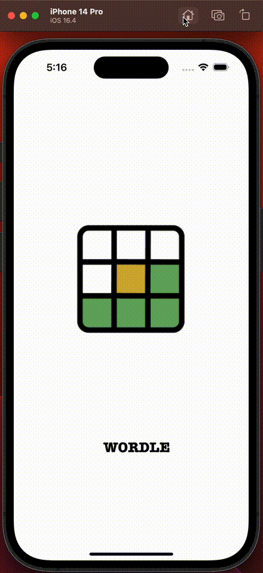

# Project 1 - Wordle

Submitted by: Lana Do

Wordle is an app where user can play a basic version of Wordle where users have six attempts to guess a five-letter word, with feedback given for each guess in the form of colored tiles indicating when letters match or occupy the correct position

Time spent: 4 hours spent in total

## Required Features

The following **required** functionality is completed:

- [x] App displays a keyboard on the screen
- [x] When tapping on the keyboard, a letter is shown or deleted (letter selected)
- [x] User can play a basic version of Wordle, with different goal words each time

The following **optional** features are implemented:

- [x] Improve and customize the user interface by adding a launchscreen and app icon
- [ ] Run the app on a device rather than in the simulator

The following **additional** features are implemented:

- [ ] List anything else that you can get done to improve the app functionality!

## Video Walkthrough

## Notes

Describe any challenges encountered while building the app.

## License

    Copyright [2023] [Lana Do]

    Licensed under the Apache License, Version 2.0 (the "License");
    you may not use this file except in compliance with the License.
    You may obtain a copy of the License at

        http://www.apache.org/licenses/LICENSE-2.0

    Unless required by applicable law or agreed to in writing, software
    distributed under the License is distributed on an "AS IS" BASIS,
    WITHOUT WARRANTIES OR CONDITIONS OF ANY KIND, either express or implied.
    See the License for the specific language governing permissions and
    limitations under the License.
